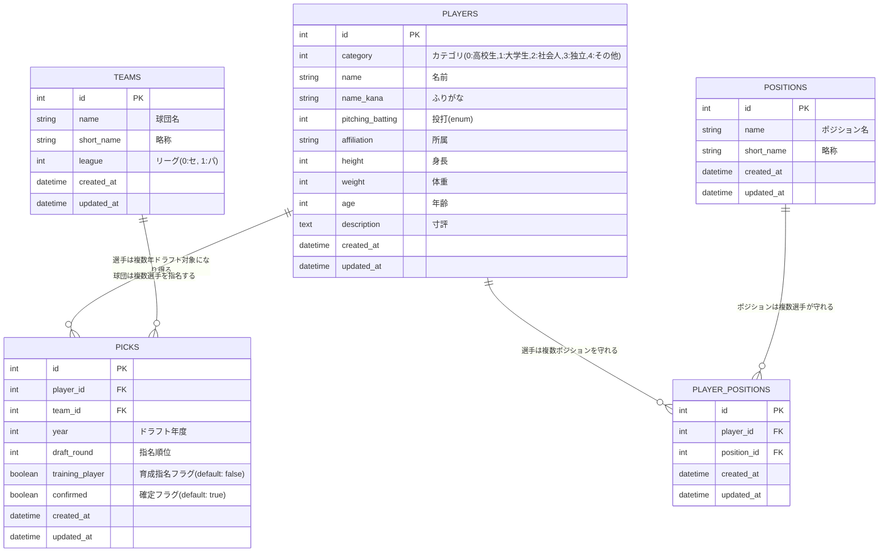

# Draft Watcher

NPBドラフト会議のデータを管理するWebアプリケーション

## アプリケーション概要

Draft WatcherはNPB（日本プロ野球）のドラフト会議に関するデータを効率的に管理するためのRailsアプリケーションです。

### 主な機能（1stフェーズ）

- **ドラフト候補選手の管理**
  - ドラフト候補選手のCRUD操作（登録・編集・削除・一覧表示）
  - 選手の詳細情報管理（所属、ポジション、身体情報、寸評など）
  - ページネーション機能（1ページ50件表示）

- **検索機能**
  - 候補選手の条件検索
  - 名前・ふりがなでの検索
  - カテゴリ別、ポジション別での絞り込み

- **ドラフト結果の記録**
  - 指名球団と指名順位の登録
  - 未指名選手の管理
  - 育成指名の区別
  - 指名確定フラグの管理

- **CSV インポート・エクスポート**
  - 選手データのCSV一括エクスポート
  - CSVファイルからの選手データ一括インポート
  - エラーハンドリング（行番号付きエラー表示）

## データベース設計

### ER図



### モデル関係

- **Players ↔ Positions (多対多)**: `player_positions`中間テーブルで関連付け
- **Players → Picks (1対多)**: 1人の選手が複数年ドラフト対象になる可能性
- **Teams → Picks (1対多)**: 1つの球団が複数の選手を指名

### Enum定義

#### Player
- `category`: `{ high_school: 0, university: 1, corporate: 2, independent: 3, other: 4 }`
- `pitching_batting`: `{ right_handed_right_batting: 0, right_handed_left_batting: 1, right_handed_both_batting: 2, left_handed_right_batting: 3, left_handed_left_batting: 4, left_handed_both_batting: 5 }`

#### Team
- `league`: `{ central: 0, pacific: 1 }`

## セットアップ

### 必要な環境

- Ruby 3.2+
- Rails 8.0+
- SQLite3

### インストール手順

```bash
# リポジトリをクローン
git clone [repository_url]
cd draft_watcher

# 依存関係をインストール
bundle install

# データベースのセットアップ
rails db:create
rails db:migrate
rails db:seed

# サーバー起動
rails server
```

### シードデータ

アプリケーション起動時に以下のマスタデータが自動作成されます：

- **ポジションマスタ**: 投手、捕手、内野手4つ、外野手3つ
- **チームマスタ**: NPB12球団（2025年順位順）

## 技術スタック

- **Backend**: Ruby on Rails 8.0
- **Database**: SQLite3
- **Frontend**: Hotwire (Turbo + Stimulus)
- **CSS Framework**: Tailwind CSS
- **Asset Pipeline**: Propshaft
- **Pagination**: Kaminari
- **I18n**: 日本語対応（config/locales/ja.yml）

## アーキテクチャ

### サービスクラス

ビジネスロジックをコントローラーから分離するため、以下のサービスクラスを実装：

- **PlayerCsvExporter**: 選手データのCSVエクスポート処理
  - I18nを使用した日本語変換
  - ポジション情報のフォーマット

- **PlayerCsvImporter**: 選手データのCSVインポート処理
  - バリデーション・エラーハンドリング
  - トランザクション処理
  - N+1クエリ対策（Position事前読み込み）

### ルーティング設計

RESTfulな設計に準拠：

```ruby
resources :players              # 選手管理
resources :picks                # 指名結果管理

namespace :player do
  resource :import              # CSVインポート
  resource :export              # CSVエクスポート
end
```
